# - Creating a Secure AWS Environment -

## - Objectives -
#### Create a basic AWS environment and apply foundational security controls using AWS best practices. The environment includes an AWS account with protected root access, IAM users with least privilege, MFA, a custom VPC, a secured EC2 instance, locked-down security groups, and a private S3 bucket.

## - Creating IAM users -
#### within AWS I want to create an "Admins" user group, this is to simulate what a business would do if they require multiple users to have administrator access. 
#### To do this I will open IAM and then complete the following steps
- User groups → Create group
- Create a group called "Admins"
- Attached permissions policy AdministratorAccess
 
 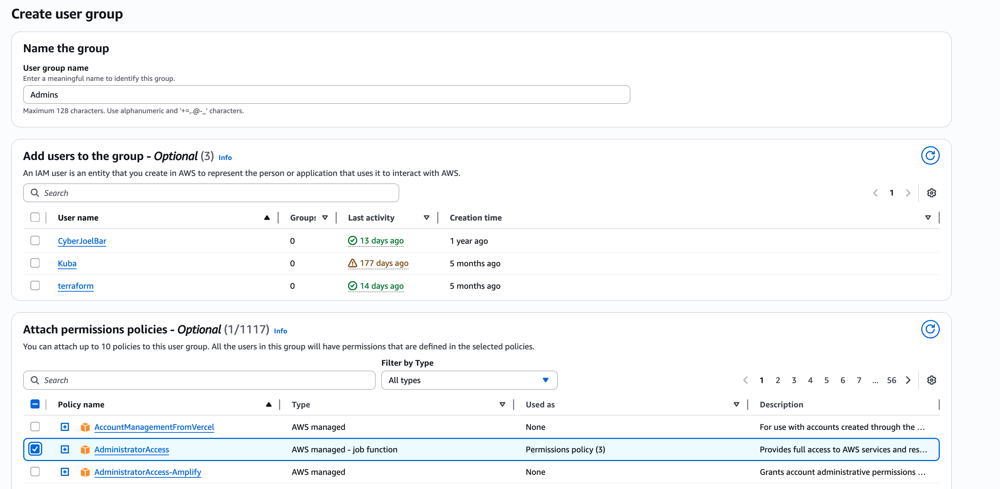
 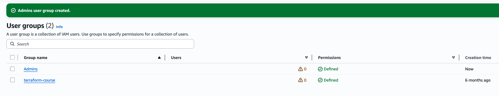

 #### As can be seen, I now have a group called "Admins" in my User Groups.

 ## - Creating an Admin User -
 #### Now that I have my group for the admins I will now create an admin user by completing the following steps
 - Users → Create user
 - Create a user called: "AdminUser"
 - Select Provide user access to the AWS Management Console
 - I chose to have a password autogenerated which would then get the user to create a new password when they went to sign in
 - I then added "AdminUser" to the "Admins" user group
 - I downloaded the CSV file containing the credentials

 ## - Enabling MFA for the IAM admin user -
 #### In order to do this I will:
 - Go into IAM
 - Select AdminUser
 - Under the security credentials tab I will find Multi-factor authentication (MFA)
 - I will then assign a device and use Microsoft's authenticator app

 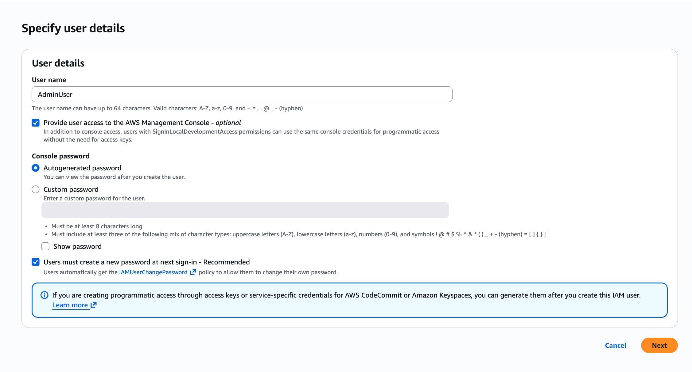
 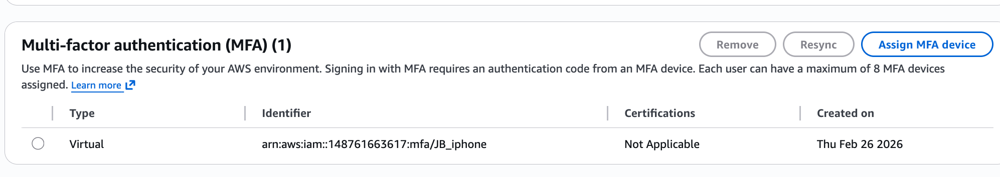
 #### As can be seen, I now have a device called "JB_iphone" which will be used for MFA when the AdminUser logs into their account

 ## - Setting up IAM password policy -
 #### Weak passwords are a massive threat to any company as if attackers can brute through their way in with a users account then they can often operate undetected for a while before being found out, to avoid weak passwords I will use IAM to set up a strong password policy
 #### To do this I will
 - IAM → Account settings
 - click Edit on the password policy tab
 
 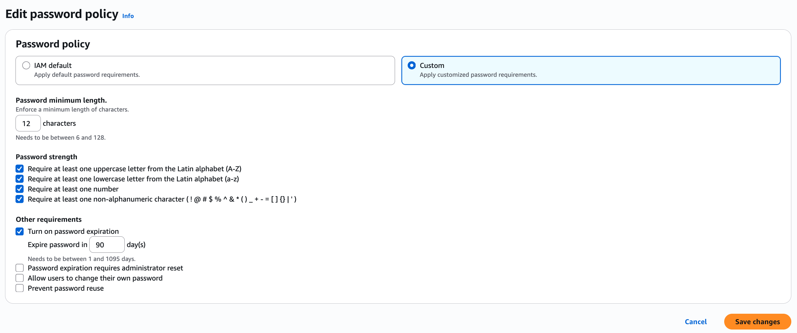

 #### As can be seen in the capture above, user's passwords will need to be
 - at least 12 characters
 - Require at least one uppercase letter
- Require at least one lower case letter
- Require at least one number
- Require at least one special character 
#### The passwords will also reset after 90 days to make sure any compromised passwords can be removed

## - Creating a secure VPC -
#### For this lab I will create a single public subnet, to do this I will

- Open the VPC dashboard and click create VPC
- I will give the VPC the name of "SecureVPC"
- for the IPv4 CIDR: 10.0.0.0/16 
- Number of AZs: 2
- Number of public subnets: 2
- Number of private subnets: 2
- NAT gateways will be set to None
- VPC endpoints set to None
- Enable DNS hostnames

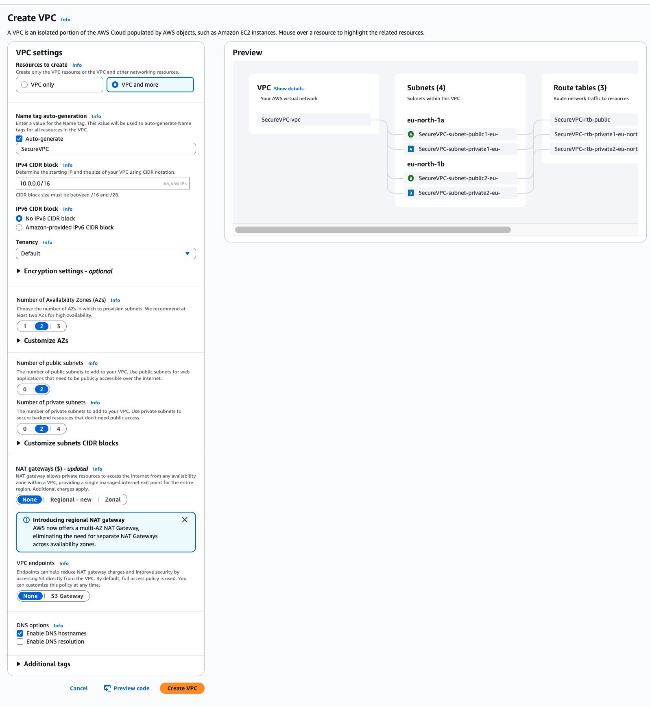

#### Setting up the VPC this way will create subnets, route tables and then it will create and attach internet gateways for public subnets

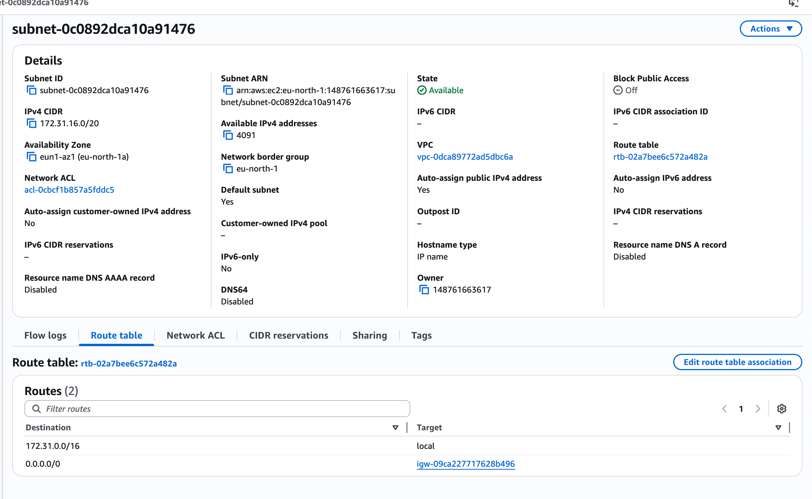

#### To confirm that my subnet is public clicked into one of them and navigated to the route table tab where I could see the route table association was 
```
0.0.0.0/0 -> igw-09ca227717628b496
```

## - Creating a Security Group - 
#### I'm going to create a security group that will allow SSH, to do this I need to open port 22, to do this i will complete the following steps

- VPC → Security groups → Create security group
- Name: EC2-Restricted-SG
- Description: “Allow SSH only from my IP”
- VPC: select SecureVPC

### For my inbound rules I will set the following

- SSH (port 22) source: My IP

### For my outbound rules I will set the following 

- Leave default “All traffic” outbound

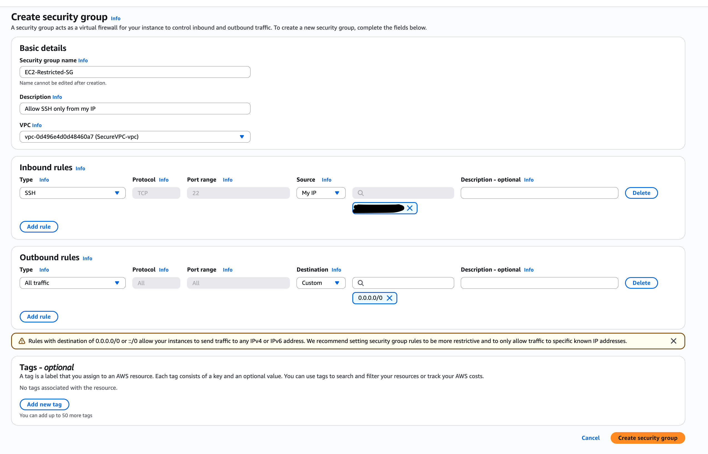 

## - Launching an EC2 Instance -
#### I'm going to create an EC2 instance and then assign it to the security group that I just made, I will do this with the following steps:

- Give the instance a name of "SecureEC2"
- Select the AMI as "Amazon Linux 2023"
- Instance  will be "t3.micro"
- Create a key pair
- VPC: I will assign my newly created "SecureVPC"
- Subnet: I will assign my public subnet
- I will auto assign my Public IP
- Security Group: I will assign "EC2-Restricted-SG" to this.

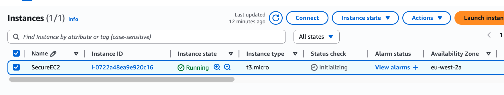 

## - Updating the EC2 instance - 
#### I have decided to do this as updating the EC2 instance helps maintain system security, reliability, and compliance with best practices by ensuring that all installed software is patched against known vulnerabilities and operating with the latest improvements.
#### To update the EC2 instance I first had to connect to it via SSH, I opened up my Mac's terminal and typed in the following commands 
```
chmod 400 SecureEc2.pem
ssh -i SecureEc2.pem ec2-user@<public-ip>
```
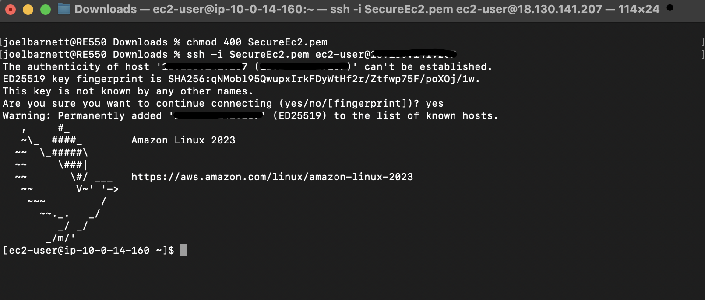

#### After successfully connecting I then ran the following command to update the EC2

```
sudo dnf update -y
```

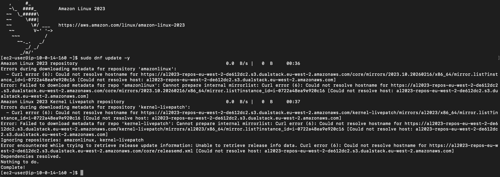

## - Creating an S3 Bucket that is private, encrypted and versioned - 
#### Amazon S3 buckets are used to store and manage data in the cloud. They provide scalable object storage where files such as images, videos, documents, backups, and application data can be stored and accessed over the internet. To create my bucket I will complete the following steps:

- Give my bucket the name of "Practice-lab-bucket-JB"
- I will create it in the eu-west-2 region (London)
- Block public access
- Enable bucket versioning
- encrypt the bucket using SSE-KMS

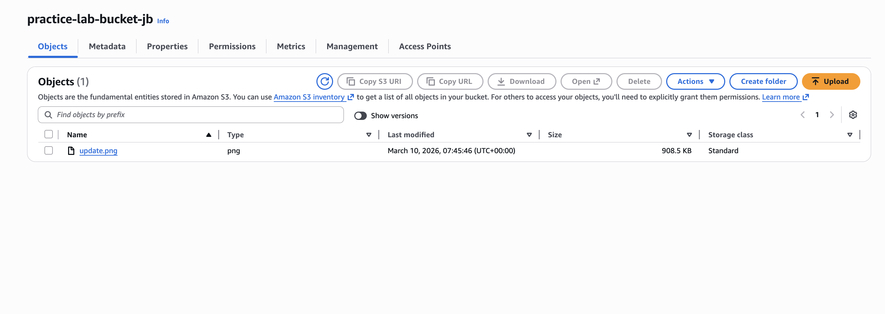
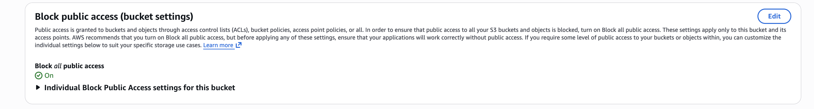
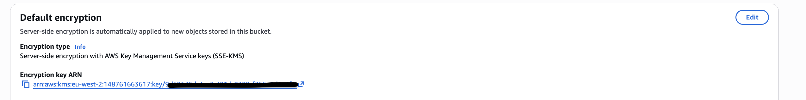

##### The S3 bucket was configured with Server-Side Encryption using AWS Key Management Service (SSE-KMS). This ensures that all objects stored in the bucket are automatically encrypted at rest using cryptographic keys managed by AWS KMS. Using SSE-KMS provides stronger security compared to standard encryption because it allows centralised key management, auditing of key usage, and fine-grained access control through AWS Identity and Access Management (IAM) policies. This configuration helps protect sensitive data stored in the bucket and aligns with cloud security best practices for protecting data at rest.

## - Summary -
#### This project involved creating a secure cloud environment using Amazon Web Services (AWS). The environment included an AWS account secured with multi-factor authentication (MFA), IAM users for controlled access, a custom Virtual Private Cloud (VPC), an EC2 instance, security groups, and an encrypted S3 storage bucket.

#### Security best practices were implemented throughout the setup. The root account was protected with MFA and not used for daily administration. Instead, an IAM administrator account was created to manage resources. Network security was established using a custom VPC and security groups, with SSH access to the EC2 instance restricted to the administrator’s public IP address to minimise exposure to unauthorised access.

#### The EC2 instance was launched using key pair authentication and updated to ensure the system was protected against known vulnerabilities. An S3 bucket was created for storage with public access blocked, versioning enabled, and server-side encryption using AWS Key Management Service (SSE-KMS) to protect data at rest.

#### Overall, the project demonstrates how core AWS services can be configured to build a secure cloud infrastructure by applying identity management, network controls, system hardening, and data protection practices.


